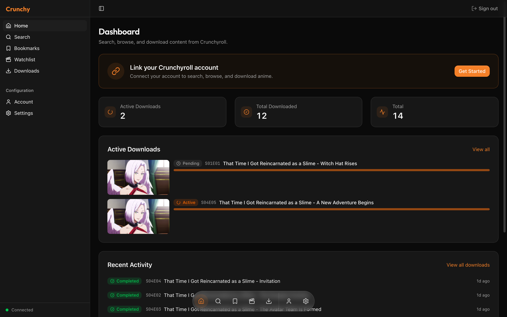
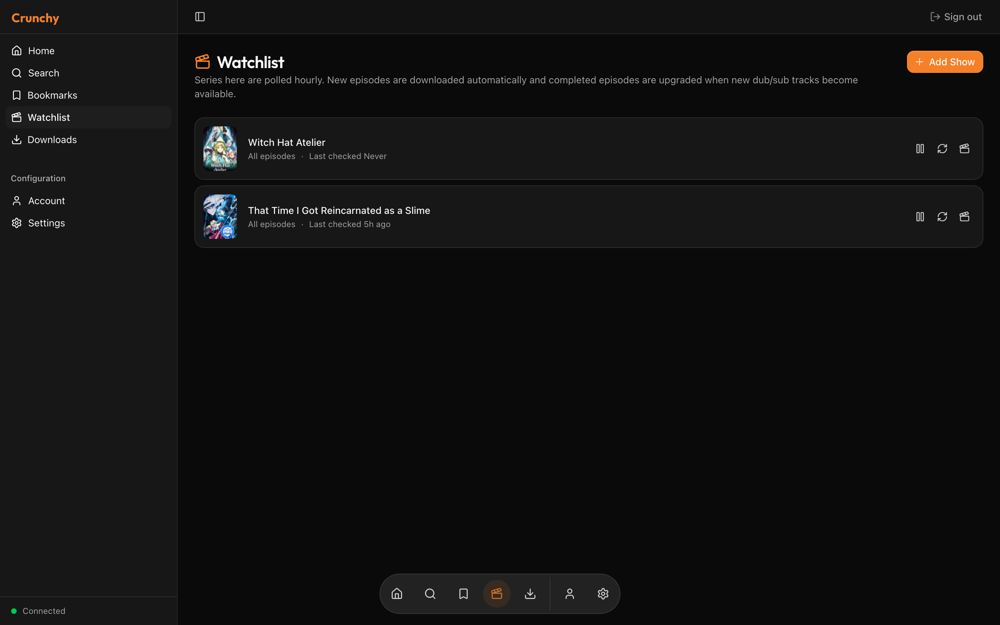
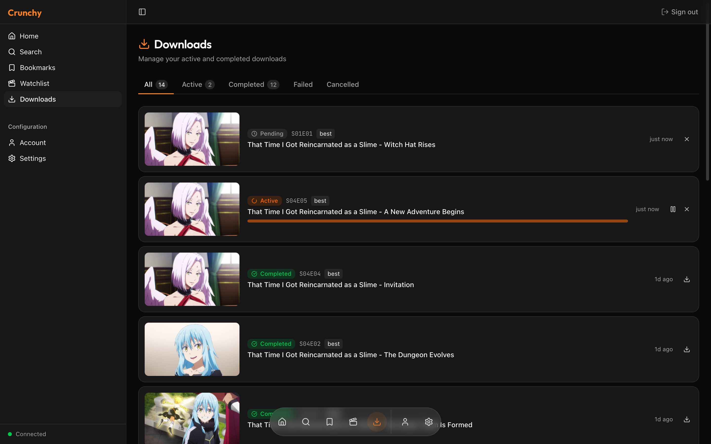
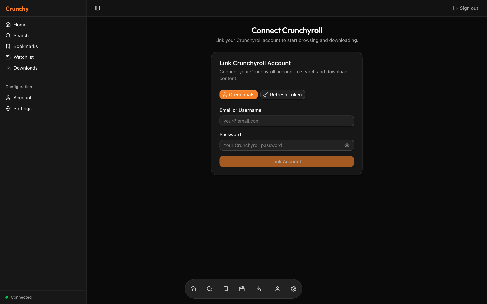
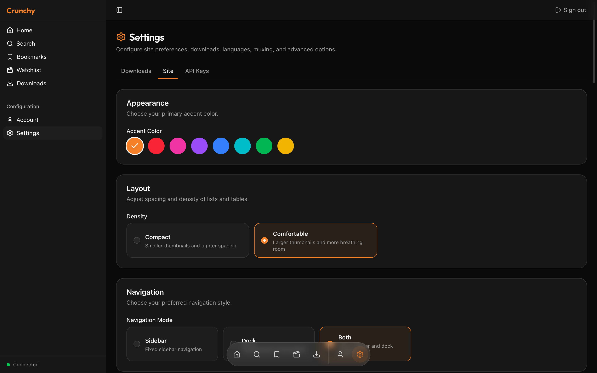
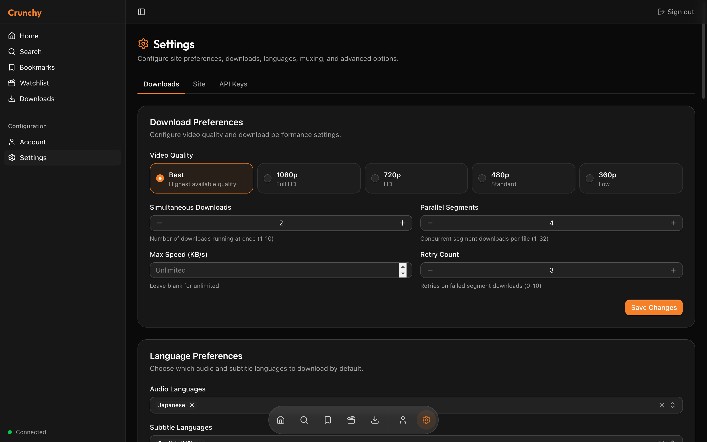
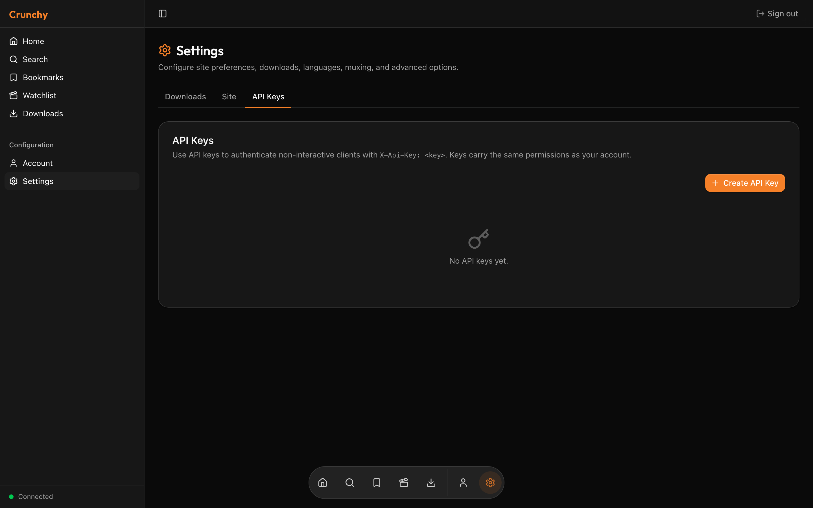
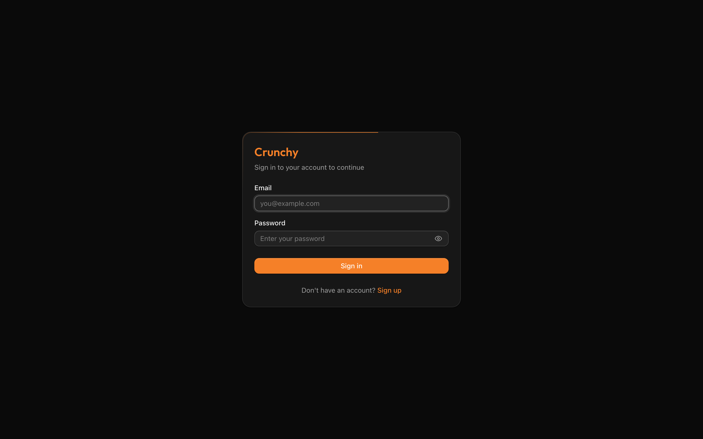

# Crunchnarr

[](https://github.com/stallerr/crunchnarr/actions/workflows/ci.yml)
[](https://github.com/stallerr/crunchnarr/actions/workflows/docker.yml)
[](LICENSE)

> *Sonarr for Crunchyroll, with auto dub upgrades.*

A self-hosted server that watches your favourite Crunchyroll series, downloads new episodes as they release, and **re-downloads completed episodes when missing audio dubs become available**. Multi-user, web UI, REST API, Sonarr-style API keys (`X-Api-Key` header, `crl_` prefix).

This is for the self-hosted / *Arr-stack crowd: Synology / Unraid / TrueNAS users who already run Sonarr, Radarr, Bazarr, Jellyfin, etc., and want a Crunchyroll piece that fits the same ergonomic.

## Why this exists

Most Crunchyroll downloaders are single-user GUI desktop apps focused on ad-hoc episode grabs. Crunchnarr is the opposite shape:

- **Headless server** with a web UI you reach from any device on the LAN.
- **Watchlist with auto-download** — pick `new_only` (only future releases) or `all` (backfill + ongoing).
- **Dub-upgrade detection** — if you originally downloaded *Frieren* sub-only and the JP dub later appears, Crunchnarr re-downloads it on the next poll. 24h cooldown so it doesn't hammer CR while waiting for a dub that hasn't dropped yet.
- **API keys** (`X-Api-Key: crl_...`, same header shape as Sonarr) usable on every protected route — drop into shell scripts, Home Assistant automations, etc.
- **Manual mark-as-downloaded** — flag episodes (or whole seasons) you already have on disk so the watchlist leaves them alone.
- **S3-compatible storage** — publish to MinIO / Backblaze / R2 instead of (or alongside) a local folder.
- **Bookmarks** — save series for later with editable per-series notes.

## Screenshots

| | |
|---|---|
|  |  |
| Dashboard — active downloads, recent activity, link banner | Watchlist — auto-polled series with download mode |
|  |  |
| Downloads queue — active + completed history with thumbnails | Linking a Crunchyroll account |
|  |  |
| Site settings (accent color, density, watchlist polling) | Download preferences |
|  |  |
| API keys (`X-Api-Key: crl_...`) | Sign in |

## Quick start (Docker)

### Prerequisites

- Docker + Docker Compose
- A Widevine CDM (`client_id.bin` + `private_key.pem`). Crunchnarr does **not** ship one — you supply your own. Place them in a host directory.

### Setup

```bash
git clone https://github.com/stallerr/crunchnarr.git
cd crunchnarr

cp .env.example .env
# Edit .env — at minimum set JWT_SECRET, STORAGE_SECRET_KEY, WIDEVINE_DIR

docker compose up -d --build
```

Or use the prebuilt image from GitHub Container Registry (no local build) — drop in a sibling `docker-compose.ghcr.yml`:

```yaml
# docker-compose.ghcr.yml
services:
  app:
    image: ghcr.io/stallerr/crunchnarr:latest
    network_mode: host
    environment:
      - PORT=8080
      - HOST=0.0.0.0
      - DATABASE_URL=sqlite:/data/crunchy-api.db?mode=rwc
      - JWT_SECRET=${JWT_SECRET:?}
      - STORAGE_SECRET_KEY=${STORAGE_SECRET_KEY:?}
      - DOWNLOADS_DIR=/downloads
      - API_URL=http://localhost:8080
    volumes:
      - api-data:/data
      - ${DOWNLOADS_DIR:-./downloads}:/downloads
      - ${WIDEVINE_DIR:?}:/widevine:ro
    restart: unless-stopped

volumes:
  api-data:
```

Then `docker compose -f docker-compose.ghcr.yml up -d`. The image publishes for both `linux/amd64` and `linux/arm64`.

Open `http://localhost:3000`. Register an account, link your Crunchyroll account in **Account → Crunchyroll**, drop your Widevine credentials in **Settings → Downloads → Widevine DRM**, and you're up.

### Required environment variables

| Variable | Purpose |
|---|---|
| `JWT_SECRET` | Signing secret for auth tokens. Stable across restarts or all sessions invalidate. `openssl rand -base64 32`. |
| `STORAGE_SECRET_KEY` | 32-byte AES-256-GCM key used to encrypt Widevine blobs / S3 secrets at rest in SQLite. **Keep this stable** — losing it means the encrypted blobs can't be recovered. `openssl rand -hex 32`. |
| `WIDEVINE_DIR` | Host path holding your CDM files (mounted read-only in the container). |
| `DOWNLOADS_DIR` | Host path for downloaded files (defaults to `./downloads`). |

Optional:

| Variable | Default | Purpose |
|---|---|---|
| `ACCESS_TOKEN_TTL` | `3600` | Access-token lifetime (seconds). |
| `REFRESH_TOKEN_TTL` | `2592000` | Refresh-token lifetime. |
| `TRACKING_INTERVAL_SECS` | `3600` | How often the watchlist worker polls. |
| `NEXT_PUBLIC_API_URL` | `http://localhost:8080` | API URL the browser sees (baked at build time). |

### NAS / cross-filesystem note

If your `DOWNLOADS_DIR` lives on a separate filesystem (NFS / SMB share, mounted volume), Crunchnarr falls back from `rename(2)` to a byte-stream copy. You don't need to do anything; it Just Works.

### Networking

The compose file uses `network_mode: host` so the API's outbound calls use the host's IP. Cloudflare blocks requests originating from Docker's bridge in some configurations.

> **macOS users:** host networking doesn't work on Docker Desktop for Mac. For local dev, run the API natively (see [Development](#development)).

## Authentication

Two paths:

- **JWT** — `POST /auth/login` returns access + refresh tokens. The web UI uses this.
- **API keys** — create one in Settings → API Keys and send it as `X-Api-Key: crl_...`. Same permissions as JWT, no expiry. Useful for scripts.

## OpenAPI

Swagger UI at `http://localhost:8080/docs`. The spec lists every route, schema, and supported auth scheme.

## Watchlist

`/watchlist` page (or `POST /tracking` with `series_id` + `download_mode`). Two modes:

- `new_only` — only download episodes released *after* the series was added (baseline snapshot taken on add).
- `all` — backfill the whole series, then keep up.

Switching `all → new_only` re-snapshots the baseline so you don't accidentally trigger a full re-download. Click the row's clock icon to "Check now" — runs the same logic synchronously and reports `{ new_downloads, upgrades }`.

The worker also re-checks every completed episode. If your saved language settings include a track the original download is missing (e.g. JP dub wasn't out yet), the watchlist supersedes the old row, downloads again, and:

- if the new download has more tracks → drops the old superseded record.
- if it has the same tracks → drops the new (redundant) record and applies a 24h cooldown before re-checking.

## Manual mark-as-downloaded

Three-dot menu on any episode → "Mark as already downloaded." The episode gets an amber **Marked** pill and the watchlist worker leaves it alone. There's also a "Mark season as downloaded" button on the series page for bulk marks.

Useful if you have older episodes on disk (legacy yt-dlp grabs, BluRay rips, whatever) and don't want Crunchnarr re-fetching them.

## Development

### API (Rust)

```bash
cd crunchy-cli
cargo check -p crunchy-api
cargo test -p crunchy-api

JWT_SECRET=dev-secret \
STORAGE_SECRET_KEY=$(openssl rand -hex 32) \
DATABASE_URL="sqlite:./crunchy-api.db?mode=rwc" \
PORT=8080 HOST=0.0.0.0 \
cargo run -p crunchy-api
```

### Web (Next.js 16)

The project locks with `bun` (the Dockerfile uses `bun install --frozen-lockfile`). Use bun for parity:

```bash
cd crunchy-web
bun install
NEXT_PUBLIC_API_URL=http://localhost:8080 bun run dev
```

`npm install` works too but generates a divergent `package-lock.json` that may resolve different transitive versions than CI.

### Project layout

```
crunchnarr/
├── crunchy-cli/         # Rust workspace
│   ├── src/             # CLI binary + library (download manager, CR client, storage)
│   └── crates/
│       ├── api/         # REST + WS API server
│       ├── widevine/    # Vendored Widevine CDM bindings
│       └── widevine-proto/
├── crunchy-web/         # Next.js 16 web UI
├── Dockerfile           # Combined image (entrypoint runs both)
├── docker-compose.yml
└── docs/
    ├── screenshots/     # README gallery
    ├── design/          # In-tree design docs (PLAN_*)
    └── launch/          # Launch-post drafts
```

(Internal crate names still say `crunchy-*`. Cosmetic; not user-visible.)

## Stack

- **API**: Rust, Tokio, Axum, sqlx (SQLite), JWT, Argon2, utoipa.
- **Web**: Next.js 16, React 19, TypeScript, Tailwind CSS, Base UI.
- **DRM**: Widevine L3 via in-process CDM (user-supplied), mp4decrypt for segment decryption, FFmpeg for muxing.

## Legal

You provide the Widevine CDM. Crunchnarr does not bypass any DRM that you haven't already authorized via the credentials you load. Use this only for content you can lawfully access on your own Crunchyroll account, and only on devices and networks you own. Crunchyroll's Terms of Service may prohibit ripping; this project is provided as-is for personal use, with no warranty. See [LICENSE](LICENSE).

## License

[MIT](LICENSE).
